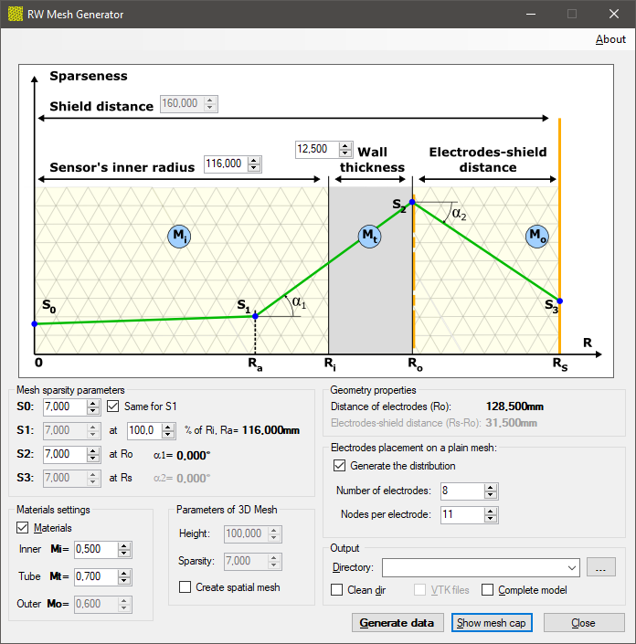

## RW Mesh Generator

Generator siatek przestrzennych s³u¿¹cych do symulacji rozk³adu
przenikalnoœci elektrycznej
oraz do rekonstrukcji obrazów p³askich i wolumetrycznych
 w Elektrycznej Tomografii Poejmnoœciowej (ECT).

Wygenerowana siatka z³o¿ona jest z czworoœcianów (simpleksów), bêd¹cych podstaw¹
obliczania równañ ró¿niczkowych metod¹ elementów skoñczonych (ang. *FEM - finit element method*).
Dla obrazów p³askich s¹ to trójk¹ty.

Generator zaimplementowany ok. 2010 na potrzeby œrodowiska Tomokis Studio.
Szczegó³y œrodowiska dostêpne np. [tutaj](docs/Aplikacja_dla_potrzeb_Banasiak_2010.pdf).

#### Ekran g³ówny
Pozwala na okreœlenie parametrów mechanicznych czujnika w postaci poszczególnych wymiarów
jego przekroju, gêstoœci elementów oraz parametrów materia³owych.

Zielona linia s0-s1-s2-s3 okreœla œredni¹ lokaln¹ gêstoœæ elementów w funkcji
promienia geometrii czujnika.

#### Siatka
Wygenerowan¹ geometriê mo¿na podejrzeæ *on-line*:

Program posiada równie¿ mo¿liwoœæ eksportu siatki do formatu popularnego œrodowiska
wizualizacji danych naukowych - *VTK*.

Koncepcja algorytmu podzia³u przestrzeni wnêtrza czujnika: 
*Nowa metoda rekonstrukcji obrazów dla potrzeb pojemnoœciowej tomografii procesowej* (rozprawa doktorska): Rados³aw Wajman, 2006.
